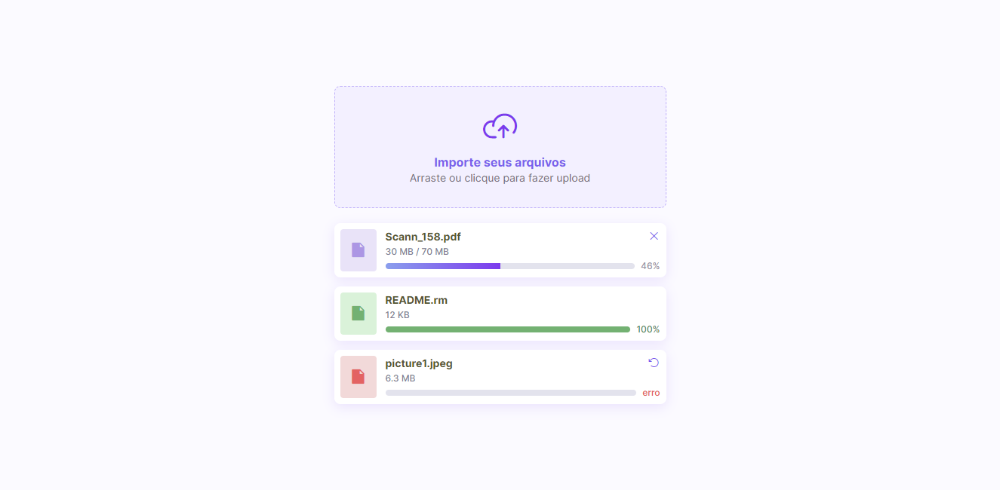

<h1 align="center"> Componente de Upload #boracodar14</h1>

Layout de um componente de uploa de arquivos desenvolvido em um evento promovido pela <a href="https://rocketseat.com.br">RocketSeat</a>  

  <a href="#-tecnologias">Tecnologias</a>&nbsp;&nbsp;&nbsp;|&nbsp;&nbsp;&nbsp;
  <a href="#-projeto">Projeto</a>&nbsp;&nbsp;&nbsp;|&nbsp;&nbsp;&nbsp;
  <a href="#-layout">Layout</a>&nbsp;&nbsp;&nbsp;|&nbsp;&nbsp;&nbsp;

 

   

## 🚀 Tecnologias

Esse projeto foi desenvolvido com as seguintes tecnologias:

- HTML e CSS
- JavaScript
- Git e Github
- Figma

## 💻 Projeto

Layout de um Componente de Upload

- [Acesse o projeto finalizado, online clicando aqui](https://carlimaraujo.github.io/uploadComponent/)

## 🔖 Layout

Você pode visualizar o layout do projeto através [DESSE LINK](https://www.figma.com/community/file/1225440656930547927). É necessário ter conta no [Figma](https://figma.com) para acessá-lo.
